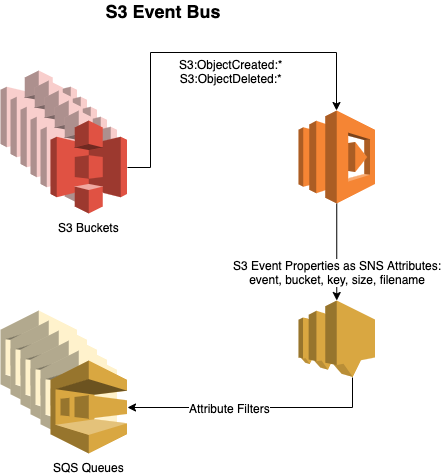

# S3 Event Bus


### Simplify S3 Event Notifications with Terraform and the S3 Event Bus  
  
It is only a matter of time before you step in some poo if you use the built-in S3 event notifications. There is a better way.  

The most massive problem with S3 event notifications is how the AWS API manages updates to the configuration. According to the AWS API documentation, the [PutBucketNotificationConfiguration](https://docs.aws.amazon.com/AmazonS3/latest/API/API_PutBucketNotificationConfiguration.html) endpoint does the following “This operation replaces the existing notification configuration with the configuration you include in the request body.”
  
The Terraform docs warn: “S3 Buckets only support a single notification configuration. Declaring multiple [aws_s3_bucket_notification](https://registry.terraform.io/providers/hashicorp/aws/latest/docs/resources/s3_bucket_notification) resources to the same S3 bucket will cause a perpetual difference in configuration.”  

In other words, you have to have ALL of your bucket event notifications in one request/place. No joy!  

Regardless of the API, I think the built-in S3 event notification system has the following weaknesses:  
* One cannot trigger multiple events from a single prefix/suffix event without coupling downstream systems.  
* It is problematic to add new functionality around a particular prefix/suffix event if the pattern is already in use. There cannot be any overlap in prefix/suffix event patterns.  

AWS does offer a built-in way to send all event notifications to an SNS topic; however, it doesn’t write SNS Message Attributes. It merely writes the object event as the SNS message body. That approach works, but it is crude. The subscribers to the topic have to consume every event and parse the message to determine if they wish to process the payload. That not only adds operational costs, but the engineers need to write code to pattern match.  

A better approach is to utilize the “[SNS Fanout](https://docs.aws.amazon.com/sns/latest/dg/sns-common-scenarios.html)” pattern. With SQS queues filtering on SNS message attributes, you can easily add decoupled systems without disturbing your fragile S3 event notification setup. This is what the S3 Event Bus was made to do.  

Great, sounds nifty; but what exactly is the S3 Event Bus?  

 
There are two Terraform modules. The first Terraform module consists of a Lambda and an SNS Topic. Since many S3 buckets can utilize the same Lambda and SNS Topic, the first Terraform module only needs to be run once.  
```
// This is done once and is a shared resource. The event bus can be used across multiple buckets.
module event_bus {
    source = "github.com/dirt-simple/terraform-aws-s3-event-bus/create-event-bus"
}
```
  
The Lambda and SNS Topic will be named “dirt-simple-s3-event-bus.”  
The second Terraform module is responsible for configuring the event notifications for a single S3 bucket.  

```
// Configure Test Bucket to Notify the S3 Event Bus.
// This is done once per bucket that you want to use the event bus.
module event_bus_configure_notifications {
    source = "github.com/dirt-simple/terraform-aws-s3-event-bus/configure-bucket"
    bucket_name = "whatzurbucket"
}
```  
Once you have the S3 Event Bus setup, you can subscribe to the topic with Email to test it out.  

See the example dir for more.